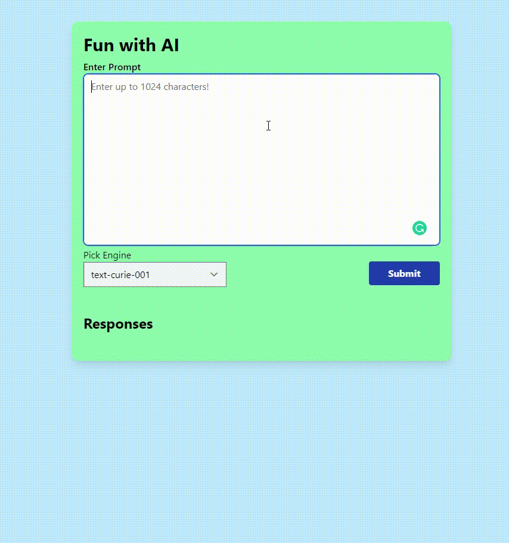

# easyWriting

Auto generate text based on the given prompt using _AI_ technology!

## Tech Stack

### Main technologies

- TypeScript
- React
- TailwindCSS

### Build

- parcel

### Formatting

- prettier

### API

- OpenAI GPT-3

### Demo

## Running application locally

Follow the following instructions to run the application locally.

1.  Get an API key from openai.com

        - Open AI offers $18 in free credits for new sign ups (no credit card required).
        - Please note free credits expire after 3 months.

2.  Then go to where you would like to store the application.

        - In a terminal run:

    `git clone https://github.com/orelbn/easyWriting`

    `cd easyWriting`

    **Make sure you have an updated version of npm and node installed.**

    - Updating npm: https://docs.npmjs.com/try-the-latest-stable-version-of-npm

3.  Run:

    `npm i`

4.  Create a .env file in your root directory

    - On linux (I believe this works for mac OS as well):

    `touch .env`

    - On windows:

    `nul > .env`

5.  Go over to your favourite code editor and update the .env file with your API key.

    `REACT_APP_API_KEY = "your API key"`

6.  Deploy the application locally by running:

    `npm run dev`

7.  Press on the local host link.

    - ex. Server running at http://localhost:1234

8.  Enjoy!

### Trouble Shooting:

- If you get an error message stating that parcel is not identified:

  `npm i -D parcel`

- Future troublshooting updates will be added below, feel free to submit an issue.
